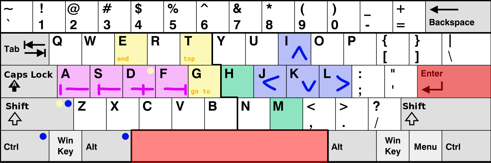

<div align="center">
    <br>
    <br>
    
    <p>Here are best key bindings ever created.<br>They are accessible, easy-to-remember and inspired with right-hand supremacy.</p>
</div>
<hr>

- [Introduction to ideas](#introduction-to-ideas)
- [Bindings list](#bindings-list)
  - [Edit mode ``by default``](#edit-mode-by-default)
  - [(N)avigate mode 👐🏻](#navigate-mode-)
    - [Right hand](#right-hand)
    - [Left hand](#left-hand)
  - [(M)anage mode 👐🏻](#manage-mode-)
    - [Right hand](#right-hand-1)
    - [Left hand](#left-hand-1)
  - [(L)ayout mode 👐🏻](#layout-mode-)
    - [Right hand](#right-hand-2)
    - [Left hand](#left-hand-2)
  - [(H)andle mode 🤚🏻](#handle-mode-)
- [Credits](#credits)

# Introduction to ideas
<!-- менять режим курсора от режима -->
FUNTICK is a keybindings map based on [VSCode](https://code.visualstudio.com/shortcuts/keyboard-shortcuts-windows.pdf), [VIM](https://vim.rtorr.com/) and [JetBrains](https://www.jetbrains.com/help/idea/mastering-keyboard-shortcuts.html) shortcuts.
Key combinations are categorized by mode, mode key combinations are divided into left-handed and right-handed, where left-handed ones are functional and right-handed ones as WASD and always stand for movement:
```
 _________________________
|                         |
|   i            UP       |    ctrl = 
| j   l  =  LEFT    RIGHT |    shift = 
|   k           DOWN      |    alt = 
|_________________________|
|                         |
|  a>s>d>f => GRADUATION  |    alt + m = SWITCH MODE
|_________________________|    n/m/l/h MODE CODES
```

# Bindings list

**What do emojis mean?**\
👐🏻 two-handed\
🤚🏻 one-handed\
🚥 graduation using asdf\
🔢 prefixes available


## Edit mode ``by default``

*There will be commands that are important to have on hand at all times*

**Code managment**
- ``ctrl + /`` - Comment/uncomment with line comment
- ``ctrl + + shift + /`` - Comment/uncomment with block comment	
- ``alt + enter`` - Smart code completion (filters the list of methods and variables by expected type)
- ``alt + shift + enter`` - Generate code... (Getters, Setters, Constructors, hashCode/equals, toString)
- ``ctrl + alt + l`` - format code
- ``ctrl + alt + i`` - optimize imports
- ``tab`` - indent selected lines
- ``shift + tab`` - unindent selected lines
- ``ctrl + x`` - Cut current line or selected block to clipboard
- ``ctrl + c`` - Copy current line or selected block to clipboard	
- ``ctrl + shift + c`` - Copy absolute path to file	
- ``ctrl + v`` - Paste from clipboard	
- ``ctrl + shift + v`` - Paste from recent buffers...
- ``ctrl + d`` - Duplicate Line/Selection	

**Search/Replace**
- ``shift shift`` - shows command palette
- ``ctrl + f`` - find
- ``ctrl + r`` - replace
- ``ctrl + l`` - Find next (if in search mode)
- ``ctrl + j`` - Find previous
<!-- do collapsing -->

<!-- Using breadcrupms  -->

**General**
- ``ctrl+s`` - save all
- ``ctrl+alt+s`` - open settings
- ``ctrl+alt+k`` - manage keybindings

**Tabs switch** (as VIM)

**To exit any mode use ``enter``/``space`` or by repeating it's keybindings**


## (N)avigate mode 👐🏻



### Right hand
- ``i`` - move cursor up
- ``l`` - move cursor right
- ``j`` - move cursor left
- ``k`` - move cursor down

- ``alt + i`` - move cursor to beginning of braces
- ``alt + l`` - move cursor to word end
- ``alt + j`` - move cursor to word start
- ``alt + k`` - move cursor to end of braces


- ``shift + i`` - jump half page up & center on cursor
- ``shift + l`` - jump cursor to end of the line
- ``shift + j`` - jump cursor to beginning of the line
- ``shift + k`` - jump half page down & center on cursor

- ``ctrl + i`` - up in file tree
- ``ctrl + l`` - go in folder
- ``ctrl + j`` - go out of folder
- ``ctrl + k`` - down in file tree

<!-- vim marks & motions -->

### Left hand
**Horizontal 🚥**
- ``a`` - to first character in the line
- ``s`` - to first non-blank character in the line
- ``d`` - to middle of the screen line
- ``f`` - to last character in screen line

**Vertical**
- ``e`` - go to (E)nd of the file
- ``t`` - go to (T)op of the file

**Text objects**
- ``gd`` - move to local declaration
- ``gD`` - move to global declaration


## (M)anage mode 👐🏻

### Right hand
- ``i`` - select up
- ``l`` - select right
- ``j`` - select left
- ``k`` - select down
- ``alt + i`` - move select/string to top
- ``alt + l`` - move select/string to right
- ``alt + j`` - move select/string to left
- ``alt + k`` - move select/string to bottom

### Left hand
- ``w`` - select a (W)ord
- ``e`` - d(E)select

**Brackets 🚥**
- ``f`` - select a block with ()
- ``d`` - select a block with {}
- ``s`` - select a block with <>
- ``a`` - select a block with []


## (L)ayout mode 👐🏻

### Right hand
- ``l`` - toggles right panel
- ``j`` - toggles left panel
- ``k`` - toggles bottom (down) panel

- ``alt + i`` - moves active tab to top
- ``alt + l`` - moves active tab to right
- ``alt + j`` - moves active tab to left
- ``alt + k`` - moves active tab to bottom

- ``shift + i`` - move cursor to the window above
- ``shift + l`` - move cursor to the right window
- ``shift + j`` - move cursor to the left window
- ``shift + k`` - move cursor to the window below

### Left hand
- ``d`` - open (D)ebug
- ``f`` - open (F)ile tree
- ``x`` - open e(X)tensions
- ``g`` - open (G)it
- ``t`` - open (T)erminal
- ``wq`` - (Q)uit active window
- ``ws`` - (S)plit window
- ``wv`` - (V)ertically split window


## (H)andle mode 🤚🏻

**File management**

- ``f`` new (F)ile

**Markdown**
-  ``v`` (View) Toggle preview on the side

# Credits
- https://marketplace.visualstudio.com/items?itemName=kaiwood.center-editor-window
- https://github.com/kasecato/vscode-intellij-idea-keybindings
- https://github.com/VSCodeVim/Vim